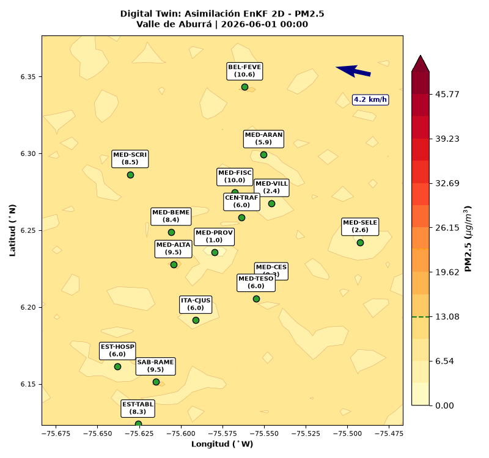

# Digital Twin: Evolution of Air Quality PM2.5 on Medellín Metropolitan Area

**Author:** Santiago Parra  
**Year:** 2026

<p center="align">
  
</p>

This project uses an advection-diffusion model and point sensor data of air quality of Medellín to reconstruct the field of fine particulate matter (PM2.5) on the Aburrá Valley via an Ensemble Kalman Filter.

## Project Structure

```text
├── media/
│   └── aburra_pm25_enkf.gif     # Simulation visualization
├── src/
│   ├── physics_jax.py           # Advection-diffusion PDE solver & wind fields
│   └── enkf_jax.py              # EnKF implementation & Gaspari-Cohn localization
├── main.py                      # Main assimilation loop & GIF generation
├── requirements.txt             # Project dependencies
└── README.md